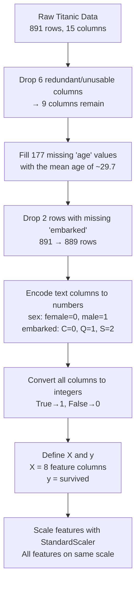

# 🎯 Model Tuning — Getting the Most Out of Your Model

> _"Training a model once on a fixed split is like judging a chef by one meal on one night. Cross-validation asks them to cook five different nights and averages the result."_

---

## What is this project?

This project uses the **Titanic dataset** to predict whether a passenger survived or died — and focuses specifically on **how to properly evaluate a model's performance** using K-Fold Cross Validation.

The same dataset and data cleaning pipeline used in previous classification projects (Decision Tree, SVM, KNN) is reused here. The key new idea is swapping the standard 80/20 train-test split for something more trustworthy: **K-Fold Cross Validation**.

---

## The Problem with a Simple Train-Test Split

When you do a regular 80/20 split:

- 80% of your data trains the model
- 20% tests it

**The issue:** That 20% test set might be lucky or unlucky. Maybe all the easy examples ended up in it, and your score looks great. Or maybe all the tricky edge cases did, and your score looks terrible. Either way, your evaluation depends heavily on which rows randomly ended up in the test set.

```
╔═════════════════════════════════════════════════════════════╗
║  Simple Split                                               ║
║                                                             ║
║  [══════════════════════ Train 80% ══╦══ Test 20% ══]      ║
║                                      ↑                      ║
║             This 20% might be        │                      ║
║             lucky or unlucky ────────┘                      ║
║             You only test ONCE                              ║
╚═════════════════════════════════════════════════════════════╝
```

---

## The Solution — K-Fold Cross Validation

Instead of testing once on one slice, you test **K times on K different slices** and take the average.

### How it works (5-Fold example)

```
╔══════════════════════════════════════════════════════════════════╗
║  Your data is divided into 5 equal chunks (folds):              ║
║                                                                  ║
║  Fold 1  Fold 2  Fold 3  Fold 4  Fold 5                        ║
║  [  1  ] [  2  ] [  3  ] [  4  ] [  5  ]                       ║
║                                                                  ║
║  Round 1: Train on 2,3,4,5 → Test on 1  → Score: 83.1%        ║
║  Round 2: Train on 1,3,4,5 → Test on 2  → Score: 82.0%        ║
║  Round 3: Train on 1,2,4,5 → Test on 3  → Score: 81.5%        ║
║  Round 4: Train on 1,2,3,5 → Test on 4  → Score: 80.9%        ║
║  Round 5: Train on 1,2,3,4 → Test on 5  → Score: 86.4%        ║
║                                                                  ║
║  Final Score = Average of all 5 = 82.8%                        ║
║                                                                  ║
║  Every row gets to be in the test set exactly once.             ║
╚══════════════════════════════════════════════════════════════════╝
```

**Analogy:** Imagine you're testing a new recipe. Instead of cooking it once and judging it, you cook it on 5 different days with 5 different groups of tasters and average their scores. Much fairer and more reliable.

---

## Dataset — Titanic

The Titanic dataset has information about 891 passengers. The goal: predict `survived` (1 = yes, 0 = no).

**Features used:**

| Column     | What it means                                         | Type    |
| ---------- | ----------------------------------------------------- | ------- |
| `pclass`   | Ticket class — 1st, 2nd, or 3rd                       | Number  |
| `sex`      | Male or Female (encoded: male=1, female=0)            | Encoded |
| `age`      | Age in years (177 missing → filled with mean ~29.7)   | Number  |
| `sibsp`    | Number of siblings/spouses aboard                     | Number  |
| `parch`    | Number of parents/children aboard                     | Number  |
| `fare`     | Ticket price paid                                     | Number  |
| `embarked` | Port of embarkation (encoded: C=0, Q=1, S=2)          | Encoded |
| `alone`    | Was the passenger travelling alone? (True→1, False→0) | Encoded |

**Columns dropped and why:**

| Column        | Reason dropped                                                      |
| ------------- | ------------------------------------------------------------------- |
| `deck`        | 688 out of 891 rows were blank — too much missing data              |
| `alive`       | Same as `survived` but written as "yes/no" — keeping it is cheating |
| `class`       | Same as `pclass` but written differently — exact duplicate          |
| `embark_town` | Same as `embarked` but written differently — duplicate              |
| `who`         | Just restates what `sex + age` already tell us                      |
| `adult_male`  | Same — already captured by `sex + age`                              |

---

## Data Cleaning Steps



---

## Why StandardScaler?

Before running KNN or SVM, we scale all features so they're on the same playing field.

**The problem without scaling:**

- `fare` ranges from £0 to £512
- `pclass` ranges from 1 to 3
- Without scaling, the model thinks `fare` is 170x more important than `pclass` just because its numbers are bigger

**StandardScaler transforms each feature so:**

- Mean = 0
- Standard deviation = 1

```
Before scaling:     fare=71.28   age=38   pclass=1
After scaling:      fare= 1.21   age=0.86 pclass=-1.04
```

Now every feature contributes fairly.

---

## Models Compared

### SVM (Support Vector Machine)

- Finds the best boundary line (or hyperplane) that separates survivors from non-survivors
- With `cv=5`: Scores `[83.1%, 82.0%, 81.5%, 80.9%, 86.4%]` → **Mean: 82.8%**

### KNN (K-Nearest Neighbours)

- Classifies a passenger by looking at the K most similar passengers and taking a majority vote
- With `cv=5`: Scores `[78.7%, 76.4%, 82.6%, 81.5%, 80.2%]` → **Mean: 79.9%**

**Comparison:**

| Model | CV Scores                      | Mean Accuracy | Consistency     |
| ----- | ------------------------------ | ------------- | --------------- |
| SVM   | [83.1, 82.0, 81.5, 80.9, 86.4] | **82.8%**     | More consistent |
| KNN   | [78.7, 76.4, 82.6, 81.5, 80.2] | 79.9%         | More variable   |

SVM wins on both accuracy and consistency across folds.

---

## Evaluation Metrics Explained

### Accuracy Score

The simplest metric — what % of predictions were correct?

```
Accuracy = Correct predictions / Total predictions
77% = (88 + 49) / 178
```

### Confusion Matrix

```
╔══════════════════════════════════════════════════════════╗
║              Predicted: Died   Predicted: Survived       ║
║  Actual: Died    88 ✓              21 ✗                  ║
║  Actual: Survived 20 ✗             49 ✓                  ║
╚══════════════════════════════════════════════════════════╝

TN = 88  → Predicted died,     actually died     ✓ Correct
TP = 49  → Predicted survived, actually survived ✓ Correct
FP = 21  → Predicted survived, actually died     ✗ False alarm
FN = 20  → Predicted died,     actually survived ✗ Missed
```

### Precision, Recall, F1

| Metric        | What it asks                                           | Formula               |
| ------------- | ------------------------------------------------------ | --------------------- |
| **Precision** | Of everyone I said survived, what % actually did?      | TP / (TP + FP)        |
| **Recall**    | Of everyone who actually survived, what % did I catch? | TP / (TP + FN)        |
| **F1 Score**  | Balanced score between Precision and Recall            | 2 × (P × R) / (P + R) |

**When to care more about Recall than Precision:**
In a medical diagnosis context — it's better to have false alarms (say cancer when there isn't) than to miss cases (say no cancer when there is). Recall = "don't miss the positives."

---

## Results Summary

```
╔══════════════════════════════════════════════════════════════════╗
║  MODEL COMPARISON — Titanic Survival Prediction                  ║
╠══════════════════════════════════════════════════════════════════╣
║                                                                  ║
║  SVM with 5-Fold CV:                                             ║
║  Fold scores: [83.1, 82.0, 81.5, 80.9, 86.4]                   ║
║  Average:     82.8%                                              ║
║                                                                  ║
║  KNN with 5-Fold CV:                                             ║
║  Fold scores: [78.7, 76.4, 82.6, 81.5, 80.2]                   ║
║  Average:     79.9%                                              ║
║                                                                  ║
║  SVM is the stronger model for this dataset.                     ║
╚══════════════════════════════════════════════════════════════════╝
```

---

## Libraries Used

| Library                                   | Purpose                                                 |
| ----------------------------------------- | ------------------------------------------------------- |
| `pandas`                                  | Loading and cleaning the dataset                        |
| `seaborn`                                 | Loading the built-in Titanic dataset                    |
| `sklearn.preprocessing.LabelEncoder`      | Encoding text columns to numbers                        |
| `sklearn.preprocessing.StandardScaler`    | Scaling features to same range                          |
| `sklearn.model_selection.cross_val_score` | Running K-Fold cross validation                         |
| `sklearn.svm.SVC`                         | Support Vector Machine classifier                       |
| `sklearn.neighbors.KNeighborsClassifier`  | K-Nearest Neighbours classifier                         |
| `sklearn.tree.DecisionTreeClassifier`     | Decision Tree (imported, reference)                     |
| `sklearn.metrics`                         | accuracy_score, confusion_matrix, classification_report |

---

## How to Run

```bash
# Install dependencies
pip install numpy pandas seaborn scikit-learn matplotlib

# Run the script
python model_tuning.py
```

The dataset is loaded directly from seaborn — no CSV needed.

---

## Key Takeaway

> Use K-Fold Cross Validation instead of a single train-test split whenever possible. It gives you a more honest, more stable estimate of how your model will actually perform on new, unseen data.

---

# Grid Search CV — Finding the Best Settings Automatically

**File:** `Grid_Search_CV.py`
**Dataset:** Iris (built into seaborn — no CSV needed)
**Goal:** Stop guessing hyperparameters by hand. Let the computer try every combination and tell you which one works best.

---

## The Problem — Too Many Knobs to Turn

Every model has settings you can change before training. In SVM, for example:

- `C` — how strict the model is about misclassifications (tried: 1, 10, 20, 30)
- `kernel` — the shape of the decision boundary (tried: `rbf`, `linear`)

In KNN:

- `n_neighbors` — how many nearby points to vote
- `weights` — equal vote or closer = more weight
- `metric` — how distance is measured

Changing these affects the score. The problem is: **there are too many combinations to try by hand**, and you don't know upfront which one is best.

Here's what happens when you pick manually:

```
KNN with n_neighbors=5  → score = 0.98    ← looks great
KNN with n_neighbors=13 → score = 1.00    ← suspiciously perfect (overfitting)

SVM with kernel='rbf', C=30 → 0.98
SVM with kernel='linear', C=10 → 0.98

Which is actually the best? Hard to say without trying all combinations.
```

---

## The Solution — GridSearchCV

GridSearchCV tries every combination from a list you give it, runs K-Fold cross validation on each one, and tells you which combination scored best.

```
You give it:
  C = [1, 10, 20, 30]
  kernel = ['rbf', 'linear']

It tries:
  C=1,  kernel=rbf    → CV score: 98.0%
  C=1,  kernel=linear → CV score: 98.0%
  C=10, kernel=rbf    → CV score: 98.0%
  C=10, kernel=linear → CV score: 97.3%
  C=20, kernel=rbf    → CV score: 96.7%
  C=20, kernel=linear → CV score: 96.7%
  C=30, kernel=rbf    → CV score: 96.0%
  C=30, kernel=linear → CV score: 96.0%

Winner: C=1 with rbf (or linear) — both at 98.0%
```

Instead of you doing this loop manually, `GridSearchCV` does it for you in one call.

---

## Dataset — Iris

The Iris dataset has 150 rows — one per flower. The goal is to predict which of 3 species it is: `setosa`, `versicolor`, or `virginica`.

| Column         | What it means              |
| -------------- | -------------------------- |
| `sepal_length` | Length of the outer petal  |
| `sepal_width`  | Width of the outer petal   |
| `petal_length` | Length of the inner petal  |
| `petal_width`  | Width of the inner petal   |
| `species`      | The label we're predicting |

This dataset is **already clean** — no missing values, no text to encode. It's a classic starter dataset, often used when you want to focus on the method (like GridSearchCV) rather than data cleaning.

---

## SVM Grid Search Results

| C   | Kernel | Mean CV Score | Rank |
| --- | ------ | ------------- | ---- |
| 1   | rbf    | 98.0%         | 1    |
| 1   | linear | 98.0%         | 1    |
| 10  | rbf    | 98.0%         | 1    |
| 10  | linear | 97.3%         | 4    |
| 20  | rbf    | 96.7%         | 5    |
| 20  | linear | 96.7%         | 6    |
| 30  | rbf    | 96.0%         | 7    |
| 30  | linear | 96.0%         | 7    |

**Finding:** Lower C values worked best. A smaller C means the model allows a few mistakes to keep the boundary simple and general. A larger C forces the model to get every training point right — which leads to overfitting.

---

## KNN Grid Search Results

Best combination found:

| n_neighbors | weights  | metric    | Mean CV Score | Rank |
| ----------- | -------- | --------- | ------------- | ---- |
| 11          | distance | minkowski | 98.67%        | 1    |
| 11          | distance | euclidean | 98.67%        | 1    |

**Finding:** `n_neighbors=11` with `weights='distance'` (closer neighbours count more) was the best setup. Compare this to `n_neighbors=13` with uniform weights which scored 1.0 on the manual test — that was overfitting. GridSearchCV with cross-validation exposes that.

---

## Libraries Used (Grid_Search_CV.py)

| Library                                    | Purpose                                    |
| ------------------------------------------ | ------------------------------------------ |
| `pandas`                                   | Converting GridSearchCV results to a table |
| `seaborn`                                  | Loading the built-in Iris dataset          |
| `sklearn.model_selection.GridSearchCV`     | Trying all hyperparameter combinations     |
| `sklearn.model_selection.train_test_split` | Splitting data for manual comparison       |
| `sklearn.svm.SVC`                          | Support Vector Machine classifier          |
| `sklearn.neighbors.KNeighborsClassifier`   | K-Nearest Neighbours classifier            |

---

# Randomized Search CV — Faster Than Trying Everything

**File:** `random_search.py`
**Dataset:** Iris (same as Grid_Search_CV.py)
**The one new idea:** Instead of testing every single combination, randomly pick a few and test those.

---

## Grid Search vs Randomized Search

|                           | Grid Search CV        | Randomized Search CV                |
| ------------------------- | --------------------- | ----------------------------------- |
| What it tries             | Every combination     | A random sample of combinations     |
| Speed                     | Slower                | Faster                              |
| You control how many?     | No — always tries all | Yes — `n_iter` sets how many to try |
| Risk of missing the best? | Never                 | Possible, but usually fine          |
| Best for                  | Small param grids     | Large param grids                   |

**Rule of thumb:** fewer than ~20 combinations, use Grid Search. Hundreds of options, use Randomized Search — it gets you close to the best without testing every single option.

---

## How n_iter Works

Grid Search with 4 values of C and 2 kernels = 8 combinations. It tries all 8.

Randomized Search with the same grid but `n_iter=4` = tries 4 randomly chosen combos out of 8.

```
Grid Search:        C=1/rbf, C=1/linear, C=10/rbf, C=10/linear, C=20/rbf, C=20/linear, C=30/rbf, C=30/linear
                    (all 8 tried)

Randomized Search:  C=30/linear, C=20/linear, C=20/rbf, C=1/linear
(n_iter=4)          (only 4, randomly picked)
```

---

## SVM Randomized Search Results

`n_iter=4` — tested 4 out of 8 possible combinations:

| C   | Kernel | Mean CV Score | Rank |
| --- | ------ | ------------- | ---- |
| 20  | rbf    | 98.0%         | 1    |
| 1   | linear | 98.0%         | 1    |
| 20  | linear | 96.7%         | 3    |
| 30  | linear | 96.0%         | 4    |

Still found a 98% result — same as full Grid Search — despite only trying half the combinations.

---

## KNN Randomized Search Results

`n_iter=5` — tested 5 out of 28 possible combinations:

| n_neighbors | weights  | metric    | Mean CV Score | Rank |
| ----------- | -------- | --------- | ------------- | ---- |
| 11          | distance | euclidean | 98.67%        | 1    |
| 13          | distance | minkowski | 98.0%         | 2    |

Same best result as full Grid Search (`n_neighbors=11, distance weighting`), despite only checking 5 out of 28 options.

---

# Ensemble Methods — Asking Many Models Instead of One

**Files:** `ensemble_learning.py` (concepts overview), `ensemble_methods.py` (all techniques with code)
**Dataset:** Iris (same as Grid Search examples)
**The idea:** Instead of training one model and trusting it, train several and combine their answers. The group is almost always smarter than the individual.

---

## Why Ensemble?

Any single model has blind spots — certain types of examples it just doesn't handle well. When you combine different models, their weak spots tend to cancel out.

```
Model A gets examples 3 and 7 wrong.
Model B gets examples 1 and 3 wrong.
Model C gets examples 3 and 9 wrong.

Majority vote:  Example 3 → all three wrong → still wrong (you can't fix what everyone gets wrong)
               Example 7 → only A wrong, B+C correct → majority says correct ✓
               Example 1 → only B wrong, A+C correct → majority says correct ✓
```

The ensemble loses where all models agree they're wrong — but gains everywhere the errors don't overlap.

---

## Three Types of Ensemble

### 1. Stacking

Train several different models (base learners) and then train a second model (meta-learner) on top of their predictions.

```
Decision Tree   → predicts: setosa
SVM             → predicts: setosa        →  Meta-Learner (Logistic Regression)
Logistic Reg.   → predicts: versicolor   →  Final prediction: setosa
```

The meta-learner learns which base models to trust and when. If Decision Tree and SVM usually agree and are usually right, the meta-learner learns to weight them more heavily.

**In code:** `StackingClassifier(estimators=base_learners, final_estimator=meta_learner, cv=5)`

---

### 2. Bagging — Random Forest

Train many of the same model type (decision trees) in parallel, each on a different random slice of the data. Take a majority vote.

```
Tree 1 (trained on rows 1-400 + 600-800): predicts setosa
Tree 2 (trained on rows 100-350 + 700-900): predicts setosa
Tree 3 (trained on rows 50-200 + 500-750): predicts versicolor
...
100 trees total → majority vote → setosa
```

Each tree sees slightly different data, so they make different mistakes. The vote averages them out.

**In code:** `RandomForestClassifier(n_estimators=100)`

---

### 3. Boosting — AdaBoost, Gradient Boosting, XGBoost

Train models in sequence. Each new model looks at what the previous one got wrong and focuses harder on those examples.

```
Round 1: Model trains normally → gets rows 3, 7, 12 wrong
Round 2: New model, rows 3, 7, 12 get extra weight → gets rows 7, 15 wrong
Round 3: New model, rows 7, 15 get extra weight → gets row 15 wrong
...and so on for 100 rounds

Final prediction = weighted combination of all rounds
```

| Algorithm         | How it boosts                                           | Result on Iris |
| ----------------- | ------------------------------------------------------- | -------------- |
| AdaBoost          | Misclassified rows get higher weight next round         | 93.3%          |
| Gradient Boosting | Each tree corrects the residual error of the previous   | 100%           |
| XGBoost           | Same as Gradient Boosting but faster and more optimised | 100%           |

**XGBoost** is the go-to for most real-world projects — it's fast, handles missing values, and almost always gives top results.

> Note: XGBoost requires numeric labels. If your target is text (like 'setosa'), encode it with `LabelEncoder` first. Sklearn models are fine with strings, XGBoost is not.

---

## Bagging vs Boosting at a Glance

|                 | Bagging (Random Forest)         | Boosting (XGBoost etc.)                  |
| --------------- | ------------------------------- | ---------------------------------------- |
| Models train... | In parallel, independently      | In sequence, each learning from the last |
| Focus           | Reduce variance (inconsistency) | Reduce bias (systematic errors)          |
| Risk            | Slower if forest is huge        | Can overfit if too many rounds           |
| Typical use     | When one tree overfits          | When you want the best possible accuracy |

---

_Part of the Algorithms/Model_Tuning series._
