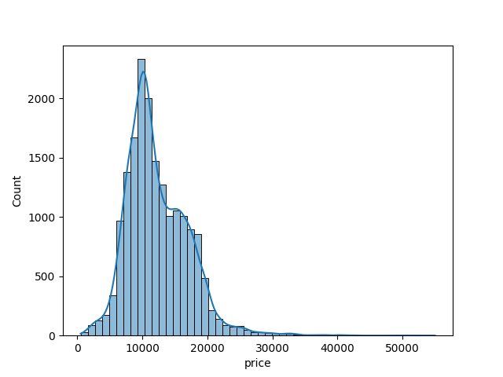
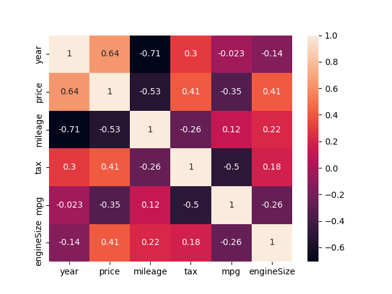
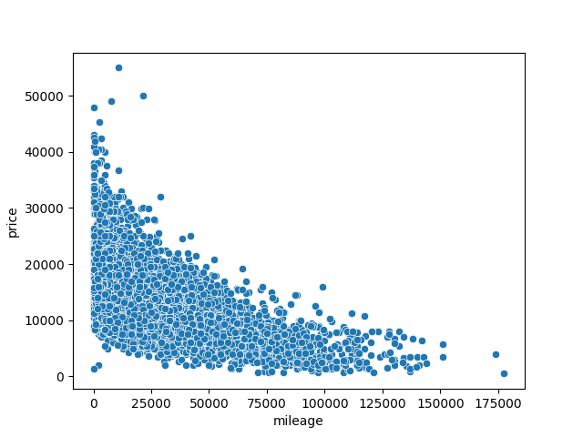
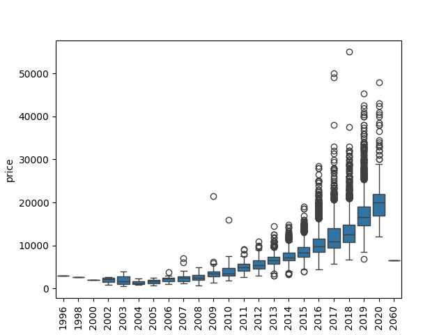
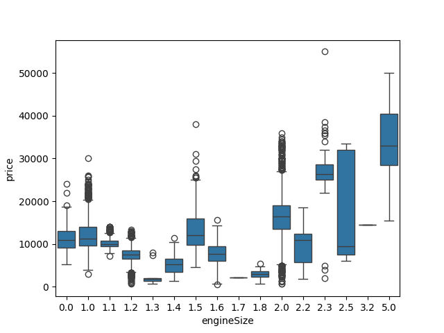
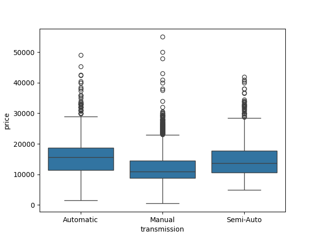
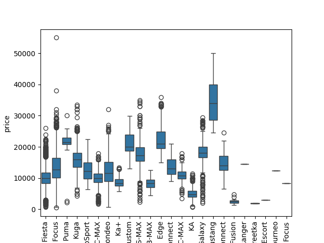

# Ford Used Car Price Prediction

First time I built a regression model from scratch properly. The dataset is Ford second hand car listings from Kaggle — around 18,000 rows. Each row is one car with details like the model name, year, mileage, fuel type and so on. The job is to predict the selling price.

The thing I was most curious about here wasn't really the model itself — it was whether the way you convert text columns into numbers actually makes a difference to the result. Turns out it makes an 11% difference, which is a lot.

---

## What's in the dataset

9 columns, about 18k cars. No missing data which was a nice surprise.

- model — car name (Fiesta, Focus, Kuga etc.)
- year — when it was made
- price — what it sold for (this is what we're trying to predict)
- transmission — Manual, Automatic or Semi-Auto
- mileage — how many miles it's done
- fuelType — Petrol, Diesel, Hybrid
- tax — yearly road tax
- mpg — miles per gallon, basically fuel efficiency
- engineSize — engine size in litres

---

## What most cars actually sell for

Before doing anything else, just looked at how prices are spread across all the listings.

---

## Do all columns actually affect the price?

Checked which columns move together — if mileage goes up and price goes down, that's useful. If tax and price have nothing to do with each other, maybe tax isn't worth keeping.

---

## Does mileage actually matter?

Plotted mileage against price to see the pattern. Higher mileage cars tend to sell cheaper — pretty obvious but good to confirm it in the data.

---

## Does the year matter?

Newer cars cost more. Again obvious, but the chart shows how strong that relationship is.

---

## Does engine size change the price?

Bigger engines generally push the price up. Seen clearly here.

---

## Petrol vs Diesel vs Hybrid — does fuel type affect price?

Some fuel types hold their value more than others.

---

## Manual vs Automatic — does it matter?

Automatics tend to cost a bit more than manuals on average.

---

## Which car model sells for the most?

Big price range depending on the model. Some models like Mustang are at the top end, smaller models like Ka are at the bottom.

---

## What actually happened

The model, transmission and fuelType columns are text. A model can't work with words so they need to become numbers. I tried two ways of doing that.

The first way — one-hot encoding — gives each category its own yes/no column. So instead of a column called "model" with words in it, you end up with columns like `model_Fiesta` and `model_Focus` each with a 1 or 0. More columns to deal with but the model doesn't get confused about any ordering.

The second way — label encoding — just swaps each word for a number. Fiesta becomes 5, Focus becomes 6 etc. Quick and simple but the model then sort of assumes Focus is somehow bigger or better than Fiesta just because 6 > 5. That's not true but the model doesn't know that.

Scaled the number columns (year, mileage, tax, mpg, engineSize) before training so the model doesn't put too much weight on columns that just happen to have big numbers.

---

## How they compared

| Method         | Score |
| -------------- | ----- |
| One-hot        | 84.6% |
| Label encoding | 73.7% |

11% gap. Same data, same model, just different encoding. One-hot won because it didn't trick the model into thinking car model names have any particular order.

---

## What I took from this

When the categories don't have any real order — like car names, city names, brand names — one-hot encoding is the way to go. Label encoding is fine when there's an actual order like shirt sizes (S < M < L < XL) or star ratings (1 to 5).
