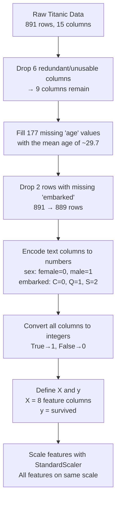

# 🎯 Model Tuning — Getting the Most Out of Your Model

> _"Training a model once on a fixed split is like judging a chef by one meal on one night. Cross-validation asks them to cook five different nights and averages the result."_

---

## What is this project?

This project uses the **Titanic dataset** to predict whether a passenger survived or died — and focuses specifically on **how to properly evaluate a model's performance** using K-Fold Cross Validation.

The same dataset and data cleaning pipeline used in previous classification projects (Decision Tree, SVM, KNN) is reused here. The key new idea is swapping the standard 80/20 train-test split for something more trustworthy: **K-Fold Cross Validation**.

---

## The Problem with a Simple Train-Test Split

When you do a regular 80/20 split:

- 80% of your data trains the model
- 20% tests it

**The issue:** That 20% test set might be lucky or unlucky. Maybe all the easy examples ended up in it, and your score looks great. Or maybe all the tricky edge cases did, and your score looks terrible. Either way, your evaluation depends heavily on which rows randomly ended up in the test set.

```
╔═════════════════════════════════════════════════════════════╗
║  Simple Split                                               ║
║                                                             ║
║  [══════════════════════ Train 80% ══╦══ Test 20% ══]      ║
║                                      ↑                      ║
║             This 20% might be        │                      ║
║             lucky or unlucky ────────┘                      ║
║             You only test ONCE                              ║
╚═════════════════════════════════════════════════════════════╝
```

---

## The Solution — K-Fold Cross Validation

Instead of testing once on one slice, you test **K times on K different slices** and take the average.

### How it works (5-Fold example)

```
╔══════════════════════════════════════════════════════════════════╗
║  Your data is divided into 5 equal chunks (folds):              ║
║                                                                  ║
║  Fold 1  Fold 2  Fold 3  Fold 4  Fold 5                        ║
║  [  1  ] [  2  ] [  3  ] [  4  ] [  5  ]                       ║
║                                                                  ║
║  Round 1: Train on 2,3,4,5 → Test on 1  → Score: 83.1%        ║
║  Round 2: Train on 1,3,4,5 → Test on 2  → Score: 82.0%        ║
║  Round 3: Train on 1,2,4,5 → Test on 3  → Score: 81.5%        ║
║  Round 4: Train on 1,2,3,5 → Test on 4  → Score: 80.9%        ║
║  Round 5: Train on 1,2,3,4 → Test on 5  → Score: 86.4%        ║
║                                                                  ║
║  Final Score = Average of all 5 = 82.8%                        ║
║                                                                  ║
║  Every row gets to be in the test set exactly once.             ║
╚══════════════════════════════════════════════════════════════════╝
```

**Analogy:** Imagine you're testing a new recipe. Instead of cooking it once and judging it, you cook it on 5 different days with 5 different groups of tasters and average their scores. Much fairer and more reliable.

---

## Dataset — Titanic

The Titanic dataset has information about 891 passengers. The goal: predict `survived` (1 = yes, 0 = no).

**Features used:**

| Column     | What it means                                         | Type    |
| ---------- | ----------------------------------------------------- | ------- |
| `pclass`   | Ticket class — 1st, 2nd, or 3rd                       | Number  |
| `sex`      | Male or Female (encoded: male=1, female=0)            | Encoded |
| `age`      | Age in years (177 missing → filled with mean ~29.7)   | Number  |
| `sibsp`    | Number of siblings/spouses aboard                     | Number  |
| `parch`    | Number of parents/children aboard                     | Number  |
| `fare`     | Ticket price paid                                     | Number  |
| `embarked` | Port of embarkation (encoded: C=0, Q=1, S=2)          | Encoded |
| `alone`    | Was the passenger travelling alone? (True→1, False→0) | Encoded |

**Columns dropped and why:**

| Column        | Reason dropped                                                      |
| ------------- | ------------------------------------------------------------------- |
| `deck`        | 688 out of 891 rows were blank — too much missing data              |
| `alive`       | Same as `survived` but written as "yes/no" — keeping it is cheating |
| `class`       | Same as `pclass` but written differently — exact duplicate          |
| `embark_town` | Same as `embarked` but written differently — duplicate              |
| `who`         | Just restates what `sex + age` already tell us                      |
| `adult_male`  | Same — already captured by `sex + age`                              |

---

## Data Cleaning Steps



---

## Why StandardScaler?

Before running KNN or SVM, we scale all features so they're on the same playing field.

**The problem without scaling:**

- `fare` ranges from £0 to £512
- `pclass` ranges from 1 to 3
- Without scaling, the model thinks `fare` is 170x more important than `pclass` just because its numbers are bigger

**StandardScaler transforms each feature so:**

- Mean = 0
- Standard deviation = 1

```
Before scaling:     fare=71.28   age=38   pclass=1
After scaling:      fare= 1.21   age=0.86 pclass=-1.04
```

Now every feature contributes fairly.

---

## Models Compared

### SVM (Support Vector Machine)

- Finds the best boundary line (or hyperplane) that separates survivors from non-survivors
- With `cv=5`: Scores `[83.1%, 82.0%, 81.5%, 80.9%, 86.4%]` → **Mean: 82.8%**

### KNN (K-Nearest Neighbours)

- Classifies a passenger by looking at the K most similar passengers and taking a majority vote
- With `cv=5`: Scores `[78.7%, 76.4%, 82.6%, 81.5%, 80.2%]` → **Mean: 79.9%**

**Comparison:**

| Model | CV Scores                      | Mean Accuracy | Consistency     |
| ----- | ------------------------------ | ------------- | --------------- |
| SVM   | [83.1, 82.0, 81.5, 80.9, 86.4] | **82.8%**     | More consistent |
| KNN   | [78.7, 76.4, 82.6, 81.5, 80.2] | 79.9%         | More variable   |

SVM wins on both accuracy and consistency across folds.

---

## Evaluation Metrics Explained

### Accuracy Score

The simplest metric — what % of predictions were correct?

```
Accuracy = Correct predictions / Total predictions
77% = (88 + 49) / 178
```

### Confusion Matrix

```
╔══════════════════════════════════════════════════════════╗
║              Predicted: Died   Predicted: Survived       ║
║  Actual: Died    88 ✓              21 ✗                  ║
║  Actual: Survived 20 ✗             49 ✓                  ║
╚══════════════════════════════════════════════════════════╝

TN = 88  → Predicted died,     actually died     ✓ Correct
TP = 49  → Predicted survived, actually survived ✓ Correct
FP = 21  → Predicted survived, actually died     ✗ False alarm
FN = 20  → Predicted died,     actually survived ✗ Missed
```

### Precision, Recall, F1

| Metric        | What it asks                                           | Formula               |
| ------------- | ------------------------------------------------------ | --------------------- |
| **Precision** | Of everyone I said survived, what % actually did?      | TP / (TP + FP)        |
| **Recall**    | Of everyone who actually survived, what % did I catch? | TP / (TP + FN)        |
| **F1 Score**  | Balanced score between Precision and Recall            | 2 × (P × R) / (P + R) |

**When to care more about Recall than Precision:**
In a medical diagnosis context — it's better to have false alarms (say cancer when there isn't) than to miss cases (say no cancer when there is). Recall = "don't miss the positives."

---

## Results Summary

```
╔══════════════════════════════════════════════════════════════════╗
║  MODEL COMPARISON — Titanic Survival Prediction                  ║
╠══════════════════════════════════════════════════════════════════╣
║                                                                  ║
║  SVM with 5-Fold CV:                                             ║
║  Fold scores: [83.1, 82.0, 81.5, 80.9, 86.4]                   ║
║  Average:     82.8%                                              ║
║                                                                  ║
║  KNN with 5-Fold CV:                                             ║
║  Fold scores: [78.7, 76.4, 82.6, 81.5, 80.2]                   ║
║  Average:     79.9%                                              ║
║                                                                  ║
║  SVM is the stronger model for this dataset.                     ║
╚══════════════════════════════════════════════════════════════════╝
```

---

## Libraries Used

| Library                                   | Purpose                                                 |
| ----------------------------------------- | ------------------------------------------------------- |
| `pandas`                                  | Loading and cleaning the dataset                        |
| `seaborn`                                 | Loading the built-in Titanic dataset                    |
| `sklearn.preprocessing.LabelEncoder`      | Encoding text columns to numbers                        |
| `sklearn.preprocessing.StandardScaler`    | Scaling features to same range                          |
| `sklearn.model_selection.cross_val_score` | Running K-Fold cross validation                         |
| `sklearn.svm.SVC`                         | Support Vector Machine classifier                       |
| `sklearn.neighbors.KNeighborsClassifier`  | K-Nearest Neighbours classifier                         |
| `sklearn.tree.DecisionTreeClassifier`     | Decision Tree (imported, reference)                     |
| `sklearn.metrics`                         | accuracy_score, confusion_matrix, classification_report |

---

## How to Run

```bash
# Install dependencies
pip install numpy pandas seaborn scikit-learn matplotlib

# Run the script
python model_tuning.py
```

The dataset is loaded directly from seaborn — no CSV needed.

---

## Key Takeaway

> Use K-Fold Cross Validation instead of a single train-test split whenever possible. It gives you a more honest, more stable estimate of how your model will actually perform on new, unseen data.

---

_Part of the Algorithms/Unsupervised/Model_Tuning series._
