# Heart Attack Prediction

Kaggle dataset on heart disease. I wanted to work with medical data for a change — the usual Titanic/iris stuff gets boring. The goal here is to figure out which patient details are actually useful for predicting heart disease, and get the data into a shape where a model can actually be trained on it.

---

## Files

- **heartattack.py** — all the code, from loading the data to final cleaned output
- **heart.csv** — the dataset (918 patients, 12 columns)
- **images/** — charts saved during exploration

---

## Dataset

918 rows, one per patient. 12 columns total.

| Column         | What it means                                                                         |
| -------------- | ------------------------------------------------------------------------------------- |
| Age            | age in years                                                                          |
| Sex            | M or F                                                                                |
| ChestPainType  | ASY = no symptoms, NAP = non-anginal pain, ATA = atypical angina, TA = typical angina |
| RestingBP      | blood pressure at rest (mm Hg)                                                        |
| Cholesterol    | cholesterol in mg/dl                                                                  |
| FastingBS      | fasting blood sugar — 1 if over 120 mg/dl, 0 if not                                   |
| RestingECG     | ECG result at rest — Normal, ST, or LVH                                               |
| MaxHR          | highest heart rate recorded                                                           |
| ExerciseAngina | chest pain during exercise — Y or N                                                   |
| Oldpeak        | ST depression on the ECG (a numeric reading)                                          |
| ST_Slope       | slope of the ST peak — Up, Flat, or Down                                              |
| HeartDisease   | 1 = has it, 0 = doesn't                                                               |

508 patients with heart disease, 410 without. Not perfectly even but close enough — didn't need to do anything special for imbalance.

---

## What I did

Started by just loading the data and running the usual checks — head, info, describe, null counts. This dataset was actually quite clean, no missing values and no duplicate rows, which was a nice surprise.

After that I spent a while just plotting things. Distributions to see the spread of each column, boxplots to check for outliers, countplots for the category columns, a violin plot to compare age across heart disease groups, and a heatmap to see which columns have any relationship with each other. All of that plotting code is commented out in the script — just uncomment whichever chart you want to see.

While looking at the data I noticed two columns had zeros that make no sense medically — cholesterol and resting blood pressure. Zero cholesterol or zero blood pressure in a patient record means the data wasn't collected, it got entered as 0 by mistake. Fixed both by replacing 0s with the mean of all the valid (non-zero) values in that column.

Text columns had to be converted to numbers since the model can't work with words. Used `pd.get_dummies()` with `drop_first=True` and then `.astype(int)` to get proper 0/1 integers. The affected columns were Sex, ChestPainType, RestingECG, ExerciseAngina, and ST_Slope.

Finally scaled the numeric columns (Age, RestingBP, Cholesterol, MaxHR, Oldpeak) with `StandardScaler`. Age ranges from 28–77 but Cholesterol can be up to 600 — without scaling those big numbers would throw things off during training.

---

## Visualizations

### Feature Distributions

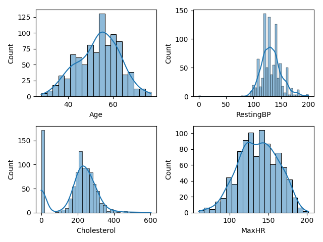
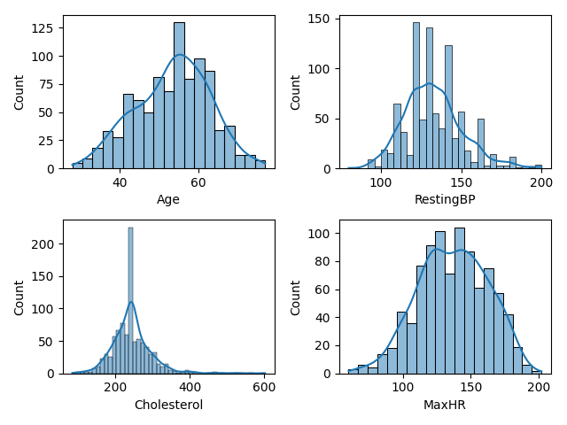

### Age

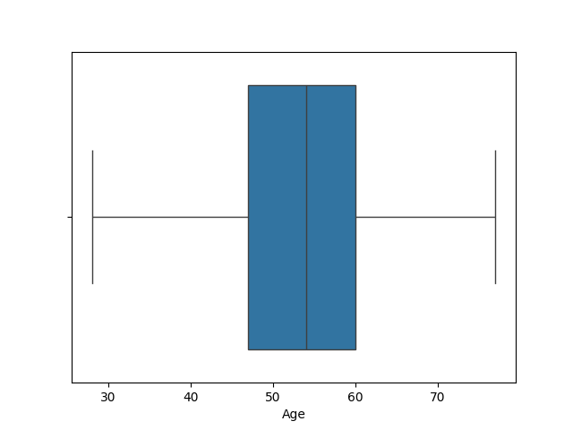
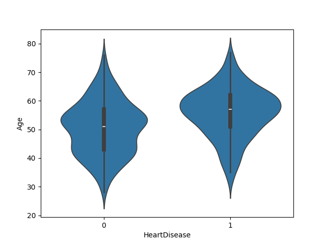

### Gender

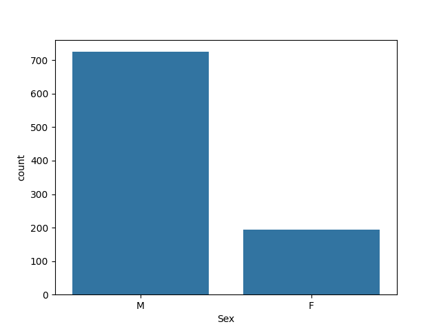
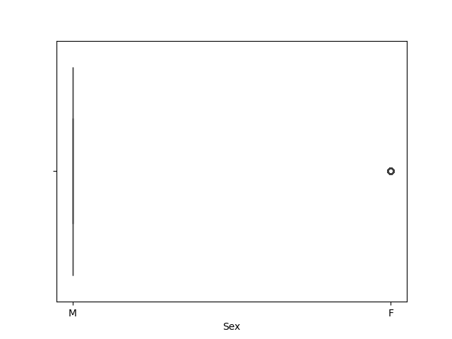
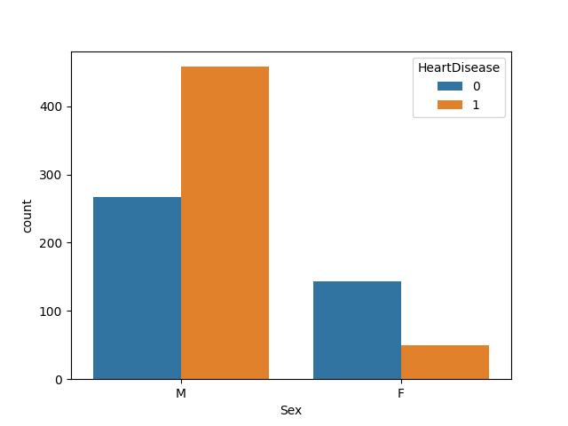

### Chest Pain

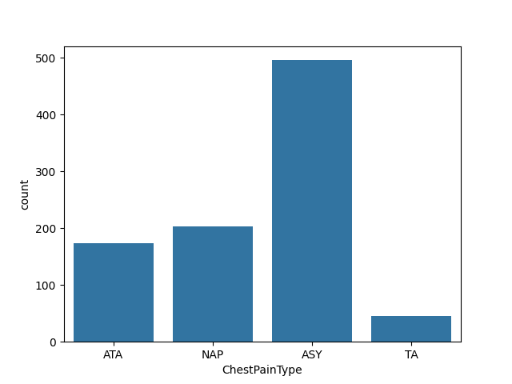
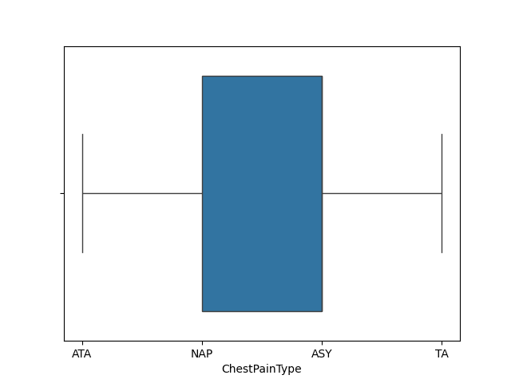
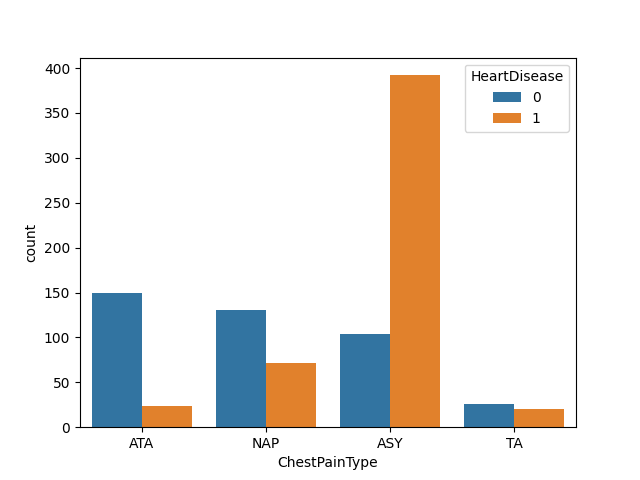

### Cholesterol

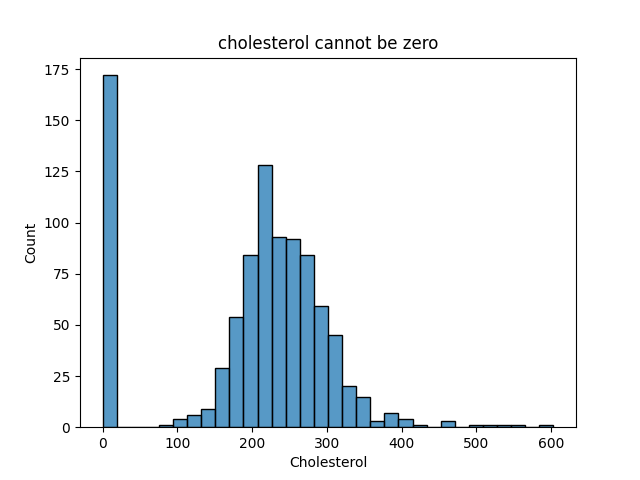
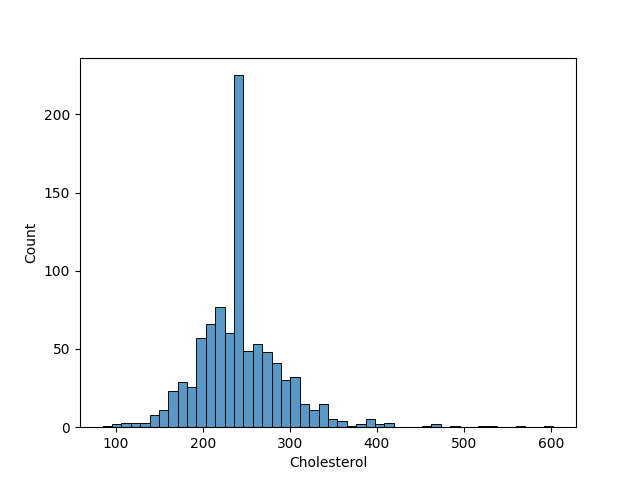
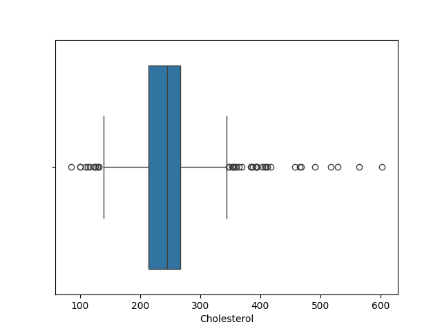
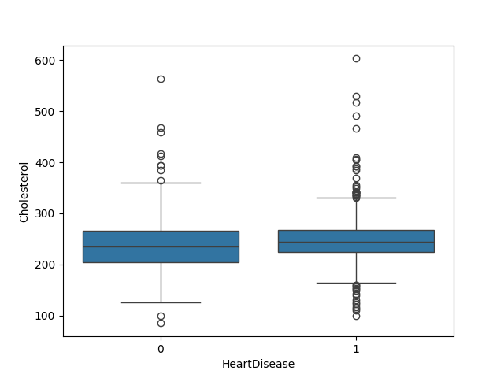

### Resting Blood Pressure

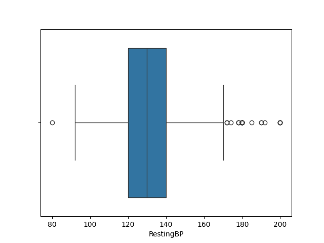
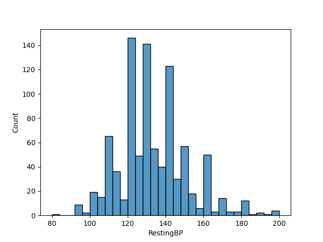

### Other Features

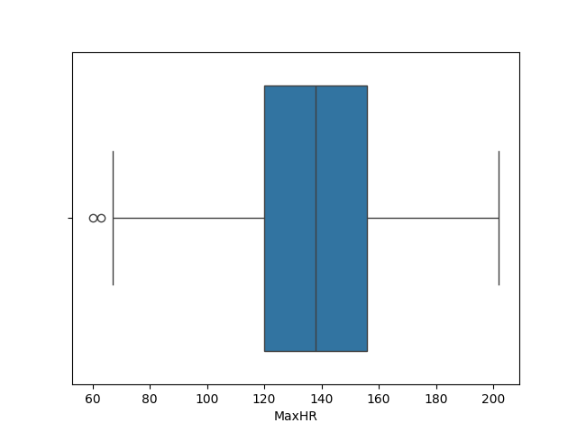
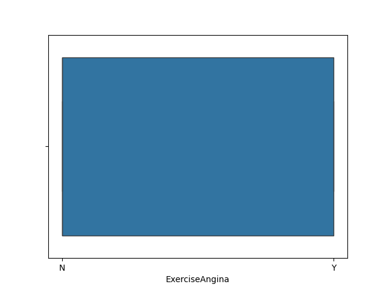
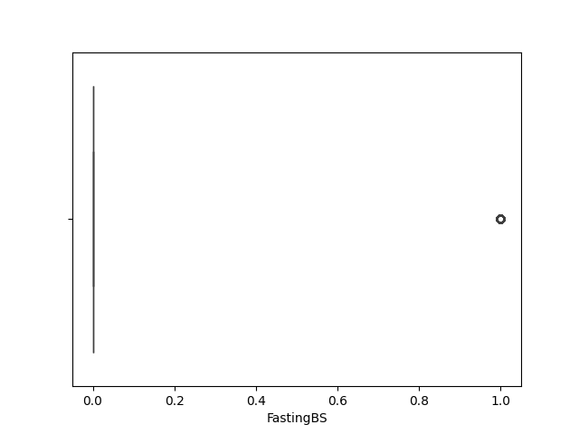
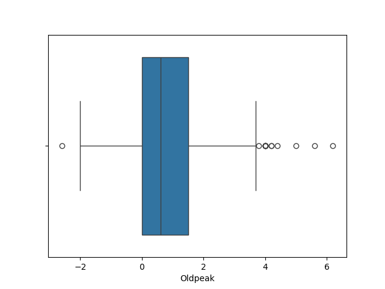
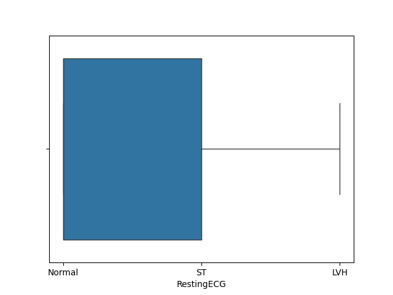
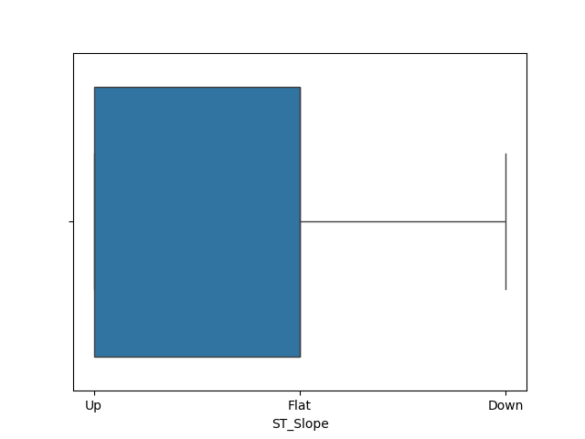

### Heart Disease

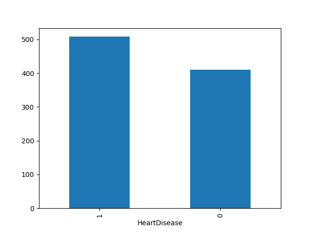
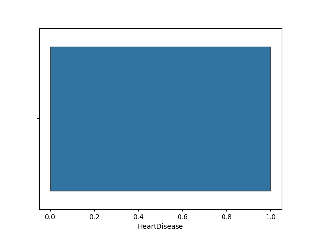

### Correlation

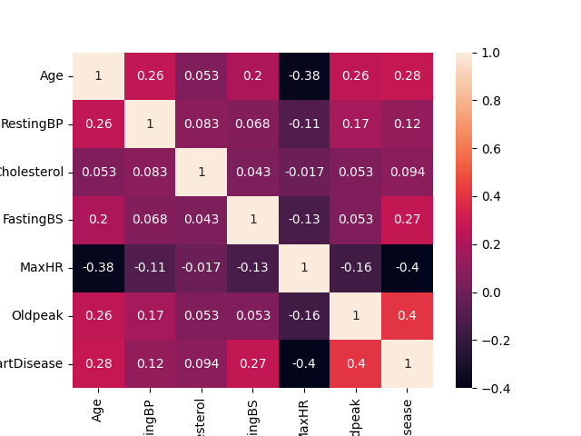

---

## Libraries

`numpy`, `pandas`, `seaborn`, `matplotlib`, `scikit-learn`

---

## A few rows from the dataset

| Age | Sex | ChestPainType | RestingBP | Cholesterol | HeartDisease |
| --- | --- | ------------- | --------- | ----------- | ------------ |
| 40  | M   | ATA           | 140       | 289         | 0            |
| 49  | F   | NAP           | 160       | 180         | 1            |
| 37  | M   | ATA           | 130       | 283         | 0            |
