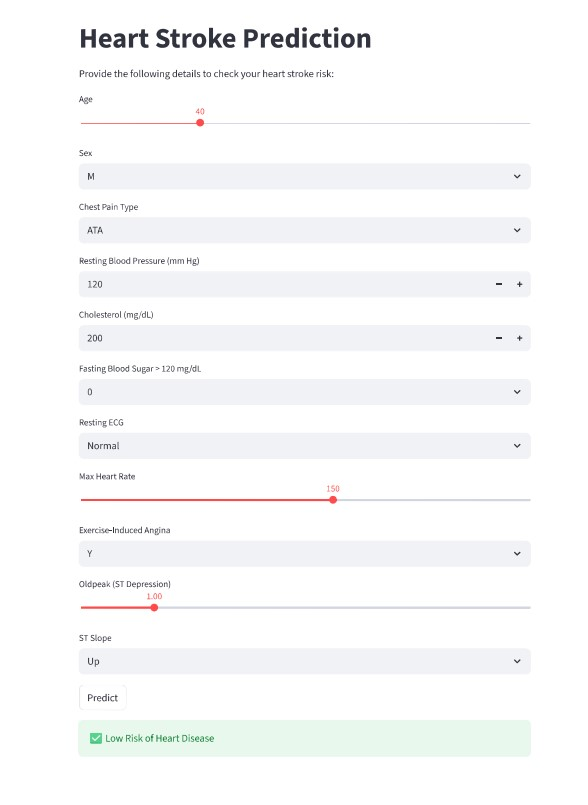

# Heart Disease Prediction — Streamlit Frontend



## What it does

A simple browser app where you fill in a few health details and it tells you whether you're at high or low risk for heart disease. Built with Streamlit — no web development needed, just Python. Powered by the KNN model trained in the parent project.

## Files it needs to run

| File                                    | What it is                                             |
| --------------------------------------- | ------------------------------------------------------ |
| `KNN_Model_heart_attack_prediction.pkl` | The trained KNN model                                  |
| `scaler.pkl`                            | The scaler used during training — must match the model |
| `columns.pkl`                           | The exact list and order of feature columns            |

All three need to be in the same folder as the script. They were saved during training in `ml_project.py`.

## Inputs

| Field                     | Type     | Range / Options   |
| ------------------------- | -------- | ----------------- |
| Age                       | Slider   | 18 – 100          |
| Sex                       | Dropdown | M, F              |
| Chest Pain Type           | Dropdown | ATA, NAP, TA, ASY |
| Resting Blood Pressure    | Number   | 80 – 200 mm Hg    |
| Cholesterol               | Number   | 100 – 600 mg/dL   |
| Fasting Blood Sugar > 120 | Dropdown | 0, 1              |
| Resting ECG               | Dropdown | Normal, ST, LVH   |
| Max Heart Rate            | Slider   | 60 – 220          |
| Exercise Angina           | Dropdown | Y, N              |
| Oldpeak                   | Slider   | 0.0 – 6.0         |
| ST Slope                  | Dropdown | Up, Flat, Down    |

## Result

- `⚠️ High Risk of Heart Disease` — model predicted class 1
- `✅ Low Risk of Heart Disease` — model predicted class 0

## Run

```bash
cd Heart_Disease_Prediction_App
streamlit run frontend_project_for_heart_attack_prediction.py
```

Opens in your browser at `http://localhost:8501`

_Requires: streamlit, pandas, scikit-learn, joblib_
